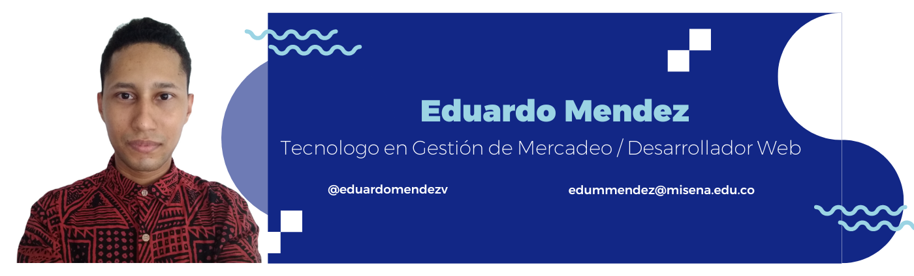

# Hi, My name is Eduardo Mendez.

I am a Web Development Student and I am a Technologist in Marketing Management.

I am learning to program and I am doing web projects with the help of Platzi. In this **README.md** I show some projects that I implemented in my process as a Web Developer.

## Projects

- [BatataBit](https://eduardommv.github.io/batatabit/)
- [Figuras Geométricas](https://eduardommv.github.io/figuras-geometricas/)
- [Porcentajes y Descuentos](https://eduardommv.github.io/porcentajes-y-descuentos/)
- [Google Clone](https://eduardommv.github.io/google_clone/)
